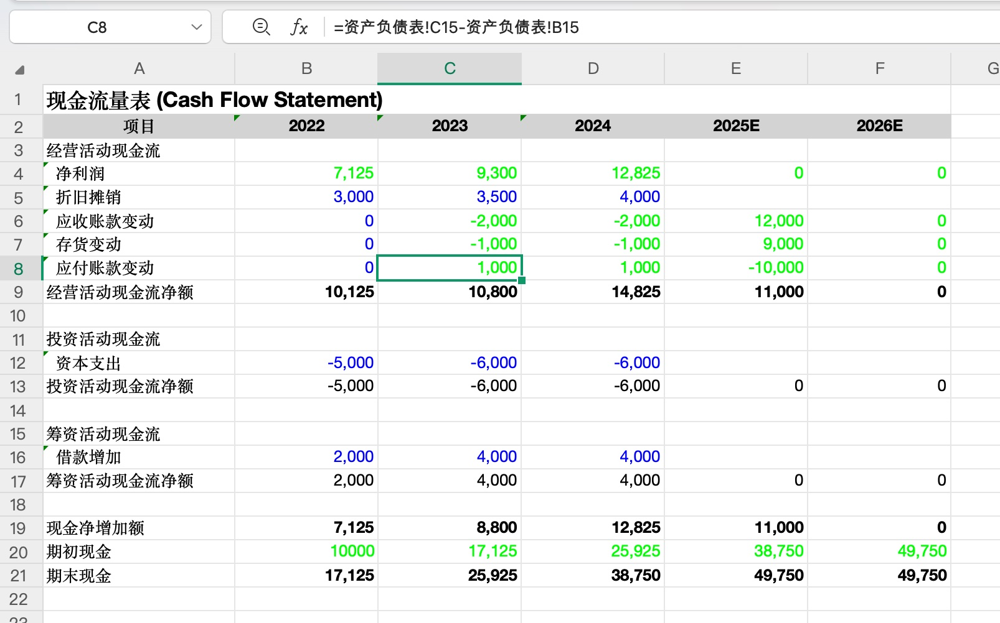
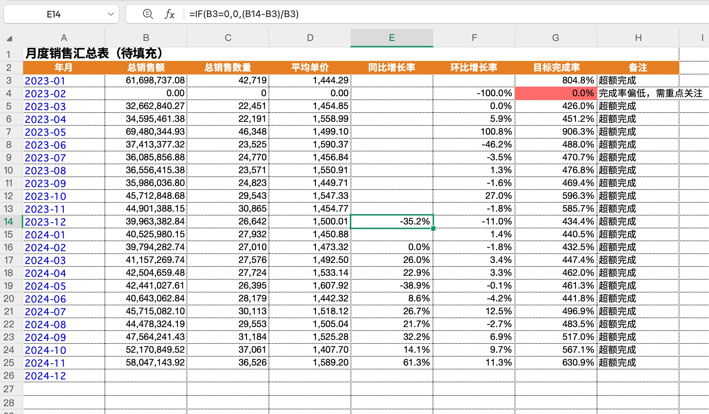
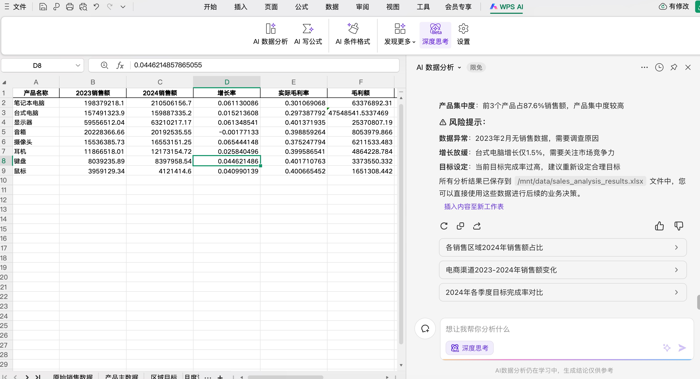
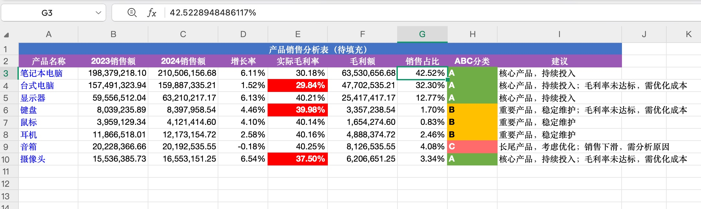

# 电子表格处理

> AI 处理电子表格进展到什么程度了？

本文原载于微信公众号：[AI 处理电子表格进展到什么程度了？](https://mp.weixin.qq.com/s/g0hXJShWB6xSlplvY2aidw)

## 用例场景

- 财务报表分析与建模
- 销售数据汇总分析
- 复杂表格的公式生成

## 核心 Skill

| 类型 | 名称 | 来源 |
|------|------|------|
| Skill | xlsx | [Anthropic 官方](https://github.com/anthropics/skills/blob/main/skills/xlsx/SKILL.md) |

## 评分

| 维度 | 分数 | 说明 |
|------|------|------|
| 效果 | 4/5 | 基本解决问题，复杂任务偶有遗漏 |
| 复现成本 | 4/5 | 安装 LibreOffice 可获得更好效果 |
| 通用性 | 4/5 | 内置华尔街投行规范，其他行业需微调 |
| 兼容性 | 5/5 | Claude Code / OpenCode / Codex 均支持 |

**综合评分：4.3/5**

## 技术特点

### 公式驱动

Skill 要求永远用公式，不硬编码计算结果。公式是「活」的，源数据变化会自动更新。

### 华尔街投行规范

收纳了一系列金融行业专业表格规范，例如颜色编码标准。非金融行业用户可能需要根据团队习惯调整。

| 颜色 | 含义 |
|------|------|
| 蓝色 | 硬编码输入值 |
| 黑色 | 公式计算值 |
| 绿色 | 引用值 |

### 工具链

| 工具 | 职责 |
|------|------|
| pandas | 数据分析、批量操作 |
| openpyxl | 处理格式、写入公式 |
| LibreOffice | 计算公式结果（可选，安装后效果更好） |

## 横向评测

### 测试任务

处理 4000+ 条记录、24 个月销售数据，填写月度汇总表和产品分析表。

### 结果对比

Skill 输出效果

WPS 输出效果

Formula Bot 效果

| 产品 | 效果 | 公式驱动 | 评价 |
|------|------|---------|------|
| xlsx Skill | 准确，格式美观 | 部分遵循 | 第一梯队 |
| WPS (DeepSeek) | 数据准确 | 否 | 格式不美观 |
| Skywork | 有可视化 | 否 | 不能下载表格 |
| Google Sheet Gemini | 只读当前 sheet | 否 | 无法跨表任务 |
| Formula Bot | 效果优秀 | 否 | 第一梯队 |

## 适用场景

| 场景 | 推荐程度 |
|------|----------|
| 财务报表自动化 | 完美契合 |
| 复杂表格公式生成 | 适用 |
| 简单一次性处理 | 可有可无 |

## 局限

- 复杂任务中可能遗漏 Skill 规范
- 偶有数据填错列的情况
- 金融行业规范不适合所有用户
