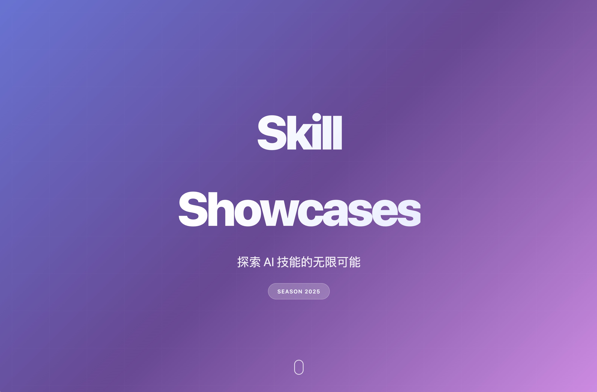
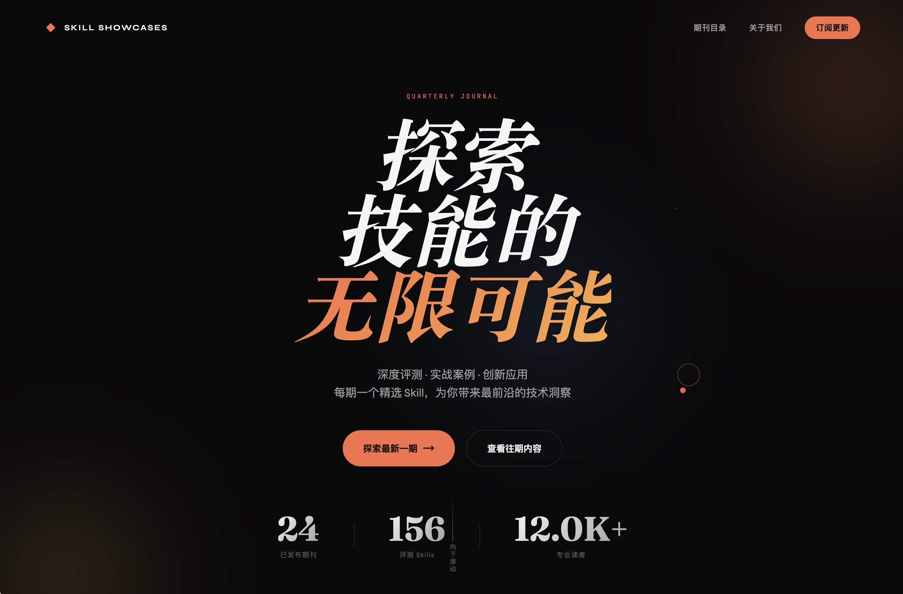
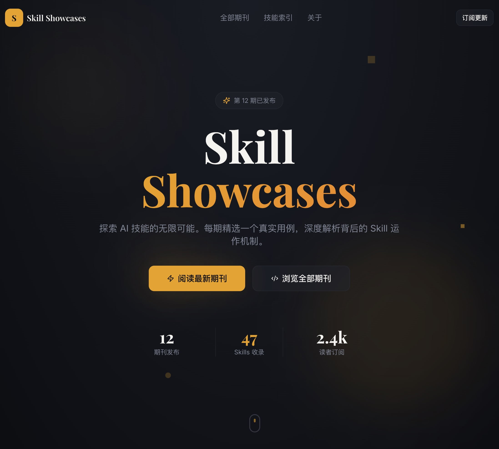

# 前端网页设计

> 用 Skill 做出审美在线、不 AI 味儿的网页

本文原载于微信公众号：[用 Skill 终于能做出来审美在线、不 AI 味儿的网页了](https://mp.weixin.qq.com/s/gG7Dx0VAQ6b3BJw2QRGgpA)

## 用例场景

- 快速生成活动页、落地页
- 设计产品原型、MVP 界面
- 制作个人作品集、博客页面

## 核心 Skill

| 类型 | 名称 | 来源 |
|------|------|------|
| Skill | frontend-design | [Anthropic 官方](https://github.com/anthropics/claude-code/blob/main/plugins/frontend-design/skills/frontend-design/SKILL.md) |

## 评分

| 维度 | 分数 | 说明 |
|------|------|------|
| 效果 | 4.5 | 效果优秀，偶有尾部排版小瑕疵 |
| 复现成本 | 5 | 安装即用，无需额外配置 |
| 通用性 | 4 | 各团队可能有自己的设计风格，需微调 |
| 兼容性 | 4 | Claude Code / OpenCode / Codex 均可用 |

**综合评分：4.4/5**

## 效果对比

### 测试一：平安夜拆礼物页面

**Prompt:**
```
设计一个平安夜祝福的前端页面，要求可以交互（拆礼物），自适应移动端
```

#### Claude 直出（无 Skill）


- Emoji 滥用，AI 味浓重
- 字体为常规 Arial，无特色

#### 使用 frontend-design Skill


- 星空背景营造夜晚氛围
- 雪花动画细节到位
- 采用 Cormorant Garamond 字体

### 测试二：Skill Showcases 网站首页

**Prompt:**
```
创建一个「Skill Showcases」网站首页，网站主要内容为期刊形式发表的 skill 评测，
每期展示一个用例及其用到的 skill。希望有些有趣的交互增加互动感。
```

#### Claude 直出



- AI 常见的紫色主题
- 交互效果粗糙

#### 使用 Skill



- 标题和卡片淡出效果流畅
- 按钮 hover 光晕精致
- 采用 Fraunces 衬线字体

#### Lovable 对比



- 交互水平尚可
- 正文使用 Inter 字体（Skill 明确避免的常见字体）
- 整体不如 Skill 效果

## 原理

frontend-design 沉淀了 Anthropic 官方《前端美学：提示词指南》中的最佳实践，包括色彩搭配、字体选择、动效设计等。

## 使用建议

安装 Skill 后直接提需求即可。建议描述清楚用途、受众和技术限制。

**一般提示词：**
```
帮我设计一个卖运动鞋的手机端商品卡片
```

**更好的提示词：**
```
请设计一个用于「限量版球鞋抽签发售」APP 的移动端商品卡片。
受众是追求潮流的 Z 世代用户，视觉重心是高清鞋图和倒计时组件。
```

## 局限

- 侧重 UI 设计，不适合复杂业务逻辑
- 状态管理等建议使用具体技术栈的 Skill

## 可选搭配

| 类型 | 名称 | 用途 |
|------|------|------|
| Skill | webapp-testing | 确保页面功能可用 |
| Hook | learning-output-style | 跟随 agent 学习前端构建 |
| Agent | code-architect | 后续开发实现 |
