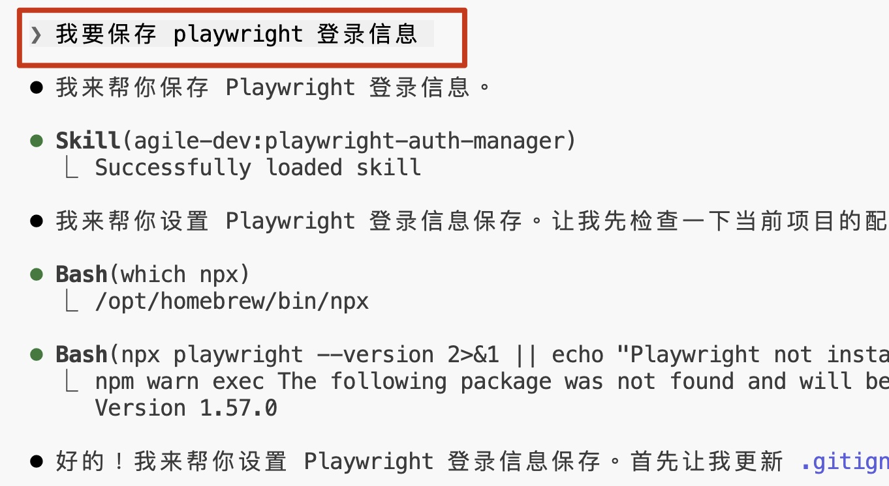
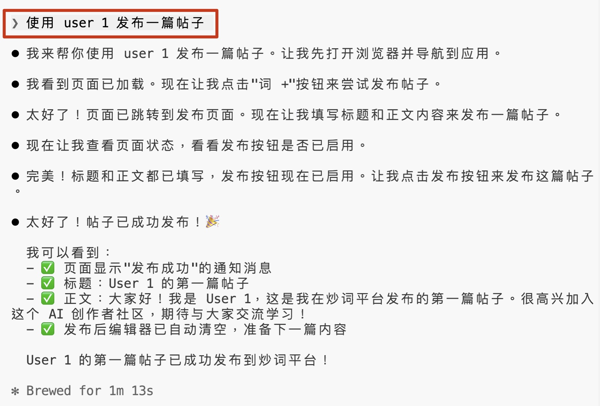
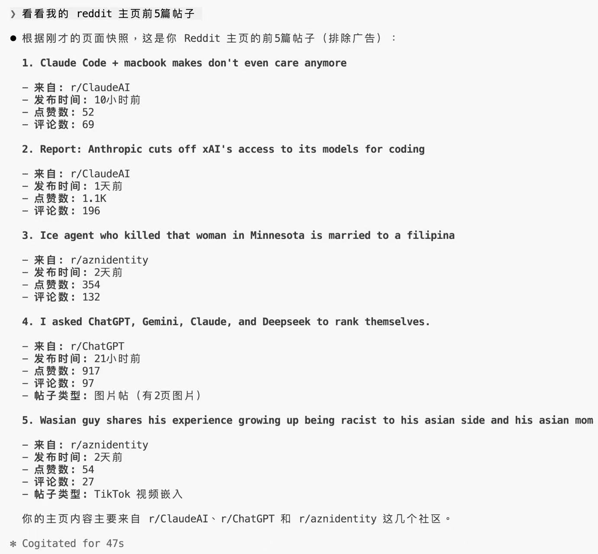

# 网站登录凭证管理

> 让 Agent 以你的身份登录网站，完成操作

本文原载于微信公众号：[如何让 Claude Code 用你的身份登录网站](https://mp.weixin.qq.com/s/vonww1q4abDx0fi3PBDprA)

## 用例场景

- **本地开发调试**：测试不同用户的界面展示
- **平台信息获取**：如 Reddit，定期抓取论坛讨论
- **自动化发布**：如小红书自动发布内容

## 核心 Skill

| 类型 | 名称 | 来源 |
|------|------|------|
| Skill | playwright-auth-manager | [GitHub](https://github.com/kanlac/agile-dev) |

## 评分

| 维度 | 分数 | 说明 |
|------|------|------|
| 效果 | 4.5 | 解决登录态问题，依赖 Playwright MCP 偶有环境问题 |
| 复现成本 | 4 | 需运行 setup 脚本安装 Playwright |
| 通用性 | 5 | 适合任何需要登录的场景 |
| 兼容性 | 4 | Claude Code / OpenCode / Codex 均可用 |

**综合评分：4.4/5**

## 解决的问题

Coding Agent 打开浏览器看到的是登录页面，无法「记住」登录状态。本 Skill 通过保存 cookies + localStorage 到 JSON 文件，让 Agent 自动加载登录态。

## 工作流程

| 脚本 | 功能 |
|------|------|
| setup.js | 安装 Playwright（不污染项目） |
| save-auth-state.js | 保存认证信息到 JSON |

## 使用示例

### 保存认证



```
你：我想保存本地开发网站 localhost:3000 的登录信息

Agent：请运行：node <path>/save-auth-state.js --url http://localhost:3000 --user dev-account
```

### 使用登录态



```
你：用刚才保存的账号，帮我发一个测试帖子

Agent：（自动处于登录状态，直接执行操作）
```

### 多账号测试

保存两份认证，配置两个 MCP 实例，Agent 可无缝切换账号。

### 获取平台信息



## 安全说明

- 自动检查 .gitignore，防止认证文件提交
- 认证文件仅保存在本地（5-50KB）

## 局限

- 分发方式尚未完善，需为不同客户端写配置手册
- 无法自动更新（仅 Claude Code GitHub Marketplace 支持）
